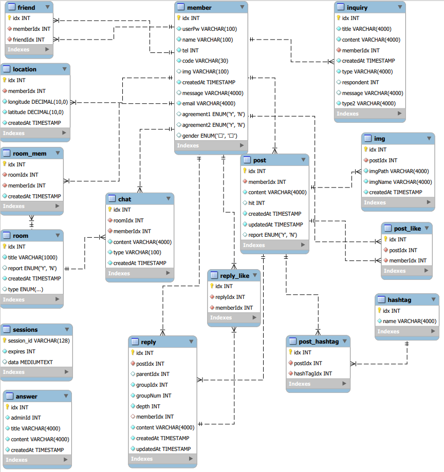
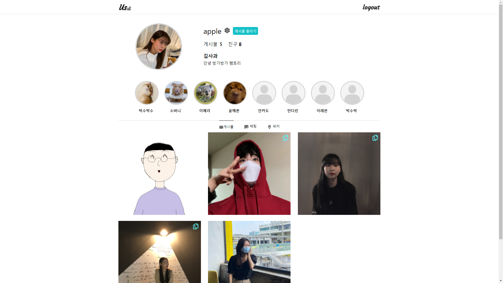
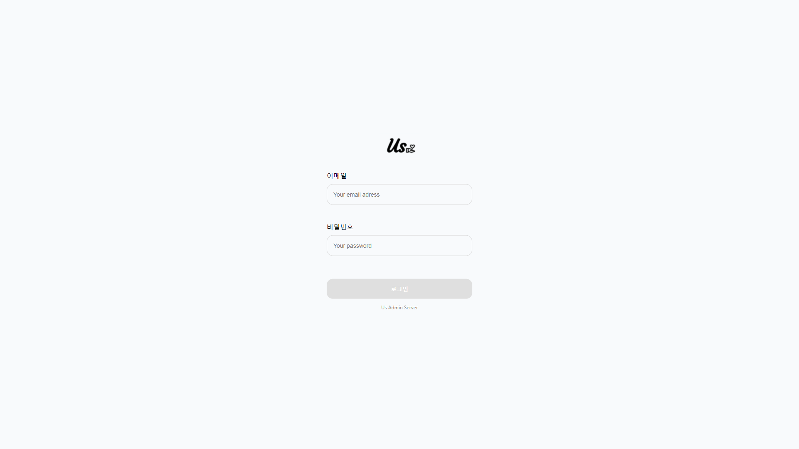
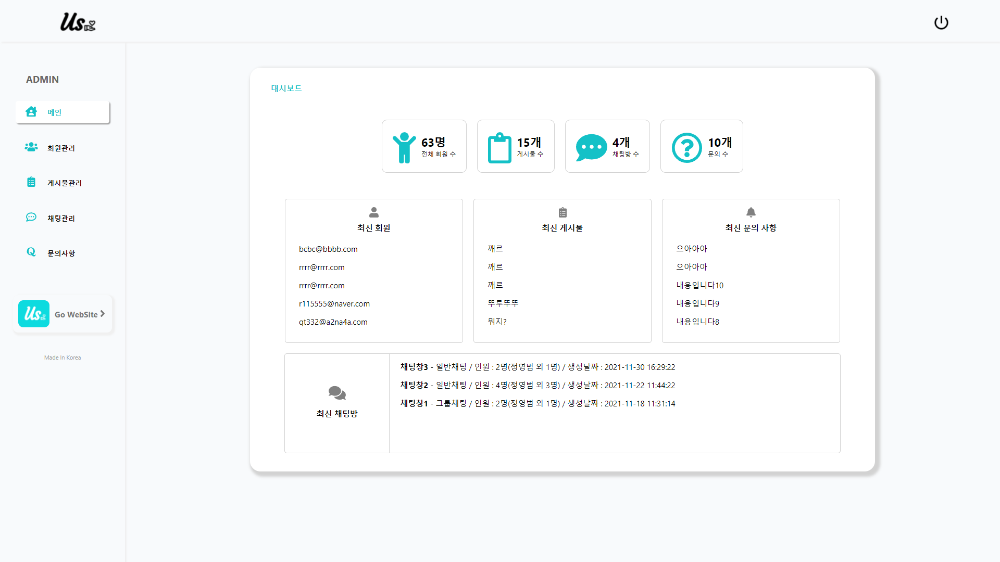

# Us 소셜 플랫폼(진행중) / Node.js Oracle
 * 개발 기간 : 2021.11.08 ~ 
 * 주제 : "Us" 소셜 플랫폼 제작
 * 개발 : Mysql , Visual Studio code
 * 사용 언어 : Node.js,React, Mysql, Javascript(ES6)
 * 사용 기술 : bcrypt, mail.api, socket.io,axios
  

## <b>프로젝트 상세내용</b> ##
### <b>구현목표</b> ###
> 사용자 페이지
1. 1:1 실시간 채팅 구현
2. 로그인, 회원가입, 아이디/비밀번호 찾기
3. SNS와 같은 게시물(이미지) 등록/수정 기능 구현
4. 해당 게시물과 댓글에 좋아요/댓글(대댓글)/팔로우 기능 구현
5. 마이페이지 정보수정, 삭제, 로그인 세션 저장

>관리자 페이지
1. 가입한 회원의 정보 및 회원의 게시물, 채팅방 목록, 상세내용 등을 확인 가능
2. 회원들이 생성한 채팅방 및 게시물, 댓글, 상세 내용 확인 가능
3. 회원들의 문의 내용 확인 및 답변 등록 및 수정
4. 조건 검색을 통한 특정 게시물 및 채팅방, 회원, 문의 검색
5. 회원 문의 삭제 기능
6. 로그인/로그아웃 기능
7. 좌측 사이드 바 하단의 로고 클릭 시 사용자 로그인 페이지로 이동
  

## <b> ERD </b> ##

  

## <b>구동 화면</b> ##
> 사용자 페이지
* 메인(/)

  
* 로그인(/login)

  

> 관리자 페이지
* 대시보드(/pages)
 

  
## <b>시연 영상</b> ##
진행 예정
