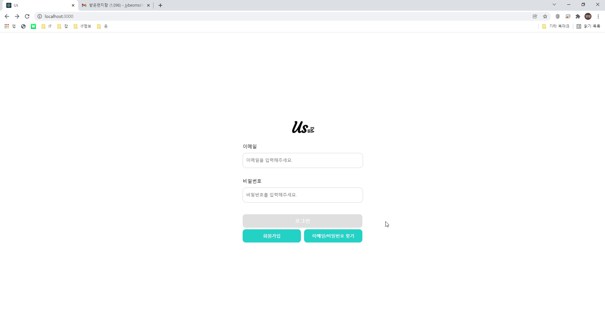

# Us 소셜 플랫폼 / Node.js & React 
 * 개발 기간 : 2021.11.08 ~ 2021.12.31
 * 주제 : "Us" 소셜 플랫폼 제작
 * 개발 : Mysql , Visual Studio code
 * 사용 언어 : Node.js,React, Mysql, Javascript(ES6), HTML5, CSS3
 * 사용 기술 : bcrypt, mail.api, socket.io,axios, Mail API
  

## <b>프로젝트 상세내용</b> ##
### <b>구현목표</b> ###
> 사용자 페이지
1. 1:1 실시간 채팅 구현
2. 로그인, 회원가입, 아이디/비밀번호 찾기(유효성 검사)
3. SNS와 같은 게시물(이미지) 등록/수정/삭제 기능 구현
4. 해당 게시물과 댓글에 좋아요/댓글(대댓글) 기능 구현
5. 마이페이지 정보수정, 탈퇴, 비밀번호 수정(이전 비밀번호, 새 비밀번호, 비밀번호 확인), 로그인 세션 저장
6. 문의하기 기능(일반 문의 /신고)

>관리자 페이지
1. 가입한 회원의 정보 및 회원의 게시물, 채팅방 목록, 상세내용 등을 확인 가능
2. 회원들이 생성한 채팅방 및 게시물, 댓글, 상세 내용 확인 가능
3. 회원들의 문의 내용 확인 및 답변 등록 및 수정
4. 조건 검색을 통한 특정 게시물 및 채팅방, 회원, 문의 검색
5. 회원 문의 삭제 기능
6. 로그인/로그아웃 기능
7. 좌측 사이드 바 하단의 로고 클릭 시 사용자 로그인 페이지로 이동
  

## <b> 담당한 기능(BackEnd) </b> ##
- node.js를 이용한 회원가입, 로그인, 아이디 찾기, 비밀번호 찾기, 비밀번호 변경, 회원정보 수정, 회원삭제
- bcrypt를 이용한 단방향 비밀번호 암호화
- session& cookie 저장 & 삭제
- socket.io를 이용한 1:1 채팅 프로그램
- DB 구현 
  

## <b> 어려웠던 부분 </b> ##
- 1차 프로젝트때 프론트엔드를 맡다 백엔드로 넘어온 케이스라 프론트에 최대한 많은 정보를 주기위해 하다보니 어디부터 어디까지 api를 넘겨야 하는 부분이 헷갈렸습니다.
- 회원가입 때 단방향 비밀번호 암호화를 걸어놔서 로그인할때 일반 비밀번호와 암호화된 비밀번호를 비교하여 로그인하는 과정에서 시간이 조금 지체되는 부분이 있었습니다.
- 백엔드에서 사용하는 포트번호와 프론트에서 사용하는 포트번호가 달라 cors 문제가 일어났습니다.
  - cors 미들웨어를 사용하여 origin에 허용하고자 하는 도메인을 넣어주어 Access-Control-Allow-Origin 내용이 추가되어 넣어준 도메인에서 오는 요청을 허용하도록 문제를 해결하였습니다.
  

## <b> 성장한 부분 </b> ##
- 개발자 입장에선 서비스가 완성되었지만, 사용자 입장에서는 많이 부족할때가 많다는 것을 알게 되었습니다.
- FE 측면에서 완성도를 높이기 위해선 클릭/효과 등 UX에 집중해야 하는 것을 깨달았습니다. 

  

## <b> ERD </b> ##

  

## <b>구동 화면</b> ##
> 사용자 페이지
* 회원가입
 

* 아이디 & 비밀번호 찾기

* 로그인

* 게시물등록

* 채팅

> 관리자 페이지
* 대시보드
 

* 관리자 게시물 관리

* 관리자 문의사항

* 관리자 채팅 관리

* 관리자 회원관리

